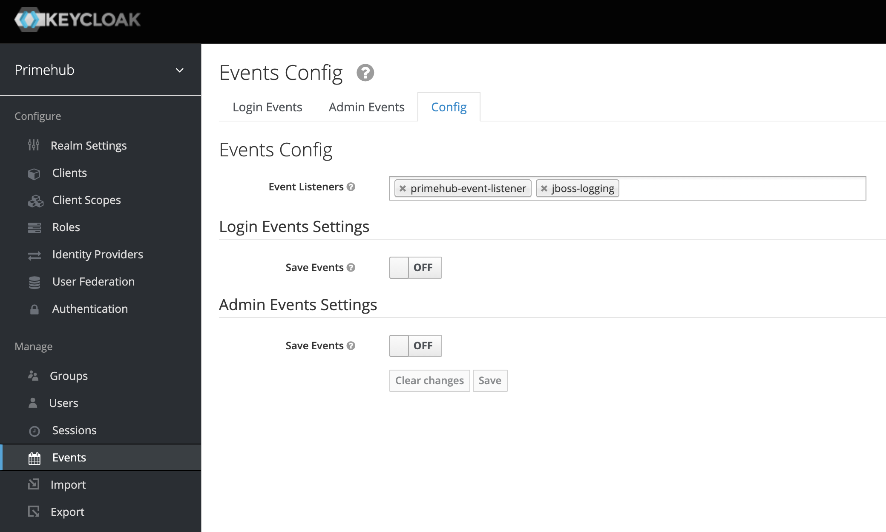

# Installation


1. Copy the built jar into `deployment`
   ```
   /opt/jboss/keycloak/standalone/deployments/primehub-user-created-event-provider.jar
   ```

2. Enable `primehub-event-listener` from the `Events
   
